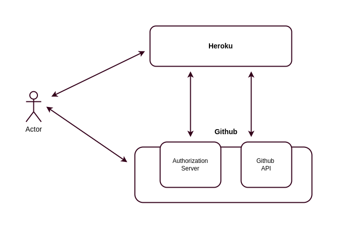
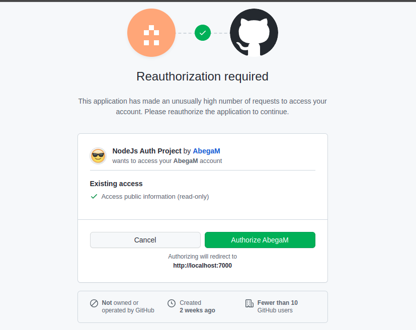

# NodeJS Authentication Template 

## About the project 

* This project is developed to show different ways of authentication strategies in a NodeJS backend API

## Getting started 

* These instructions will get you a copy of the project up and running on your local machine for development and testing purposes.

### Installation 

1. Clone the repository 

   ```
   git clone https://github.com/AbegaM/NodeJS-Authentication-Template.git
   ```

2. Install the NPM packages 

   ```
   npm install
   ```

### Set up environment variables 

* All environment variables are added in the dotenv.example file, you need to first create a .env file and you need to add the parameters below 

  ```
  SERVER_PORT
  SERVER_SECRET
  GITHUB_CLIENT_ID
  GITHUB_CLIENT_SECRET
  GITHUB_REDIRECT_URL
  GITHUB_SIGNUP_STATE
  GITHUB_SIGNIN_STATE
  
  ```

### Environment variables description

SERVER_PORT 

* Port of the server in which the server will run on 

SERVER_SECRET 

* A secret value which is used by the backend to create a JWT token, it can be a combination of string and integer 

GITHUB_CLIENT_ID 

* A client ID which is generated by Github, which will be used to create an OAuth authentication, follow [this](https://docs.github.com/en/developers/apps/building-oauth-apps/creating-an-oauth-app) tutorial to generate a client ID

GITHUB_CLIENT_SECRET 

* A client secret which is generated by Github 

GITHUB_REDIRECT_URL 

* A callback URL which is used by Github to fire a request to your server 

GITHUB_SIGNUP_STATE 

* A string value which you use to create a secure communication when users signin with Github

GITHUB_SIGNIN_STATE 

* A string value which you use to create a secure communication when users signup with Github

### Running the code 

1. Run the code in development environment 

   ```
   npm run dev
   ```

2. Run the code in production environment 

   ```
   npm run start
   ```

## Built with 

1. [NodeJS](https://nodejs.org/en/) 
2. [ExpressJS](https://expressjs.com/)
3. [PouchDB](https://pouchdb.com/)

## Explanation 

* The goal of this project is to create different authentication methods in a NodeJS application, and as we know there are many ways we can implement authentication in a NodeJS app and this can be 
  1. Token based authentication 
  2. Cookie based authentication 
  3. Two factor authentication (2FA)
  4. Passport based authentication
  5. OAuth 
  6. Auth0 
   

### OAuth 

* This protocol was never been created to implement authentication, originally it was designed to authorize two different applications. 

* As an example, lets take Heroku, as we know Heroku is a hosting service which is used to host web applications, if you have used this service before you have seen that it implements a continuous deployment by pulling your latest code from your Github account, this means every time you push your code to your main branch Heroku can be triggered and can build your latest code to a production environment. 

* For this to happen you need to allow Heroku to access your account on behalf of you, and giving a third party application your credentials would not be a good idea, so this is when OAuth comes to the picture, using OAuth your Heroku account can get a privilege to pull the latest code from your Github account. 

  

* The diagram shows how your Heroku account can access your Github account on behalf of you, here is how the flow works 

  1. The user gets to his Heroku account and will connect Github for CI/CD 
  2. The Heroku app will send a request to Githubs OAuth authorization server, to access the account 
  3. The Github OAuth server asks if the user is Heroku can access the account 
  4. If the user approved the request then Github will provide an access token for Heroku to access the Github API

* Note that the Heroku service will only be given a limited access of the Github resource and in this cane it can only pull the latest code from your main branch 

#### How can we use OAuth to authenticate with Github

* We can use the OpenID connect standard to create an application in which our users can signup and signin using Github. 

##### Signup and signin flow with Github

* If we don't want to create a signup feature for our users, we can let the users to be registered using their Github account, here is the flow 

  1. The user will send a signup request to our backend API 

     ```
     GET http://localhost:7000/api/auth/signup/github
     ```

  2. When the users send a GET request to the above API, our app will redirect the users to Githubs OAuth server 

     ```
     https://github.com/login/oauth/authorize
     ```

  3. Github will get our request and it will ask the user to allow our application to access the Github API 

     

  

  4. When the user authorizes our app, Github automatically first a GET request to our callback URL 

     ```
     GET https://localhost:7000/api/auth/callback/github
     ```

  5. When a request is fired to our callback API, the controller checkes if the users Github ID is registered in the PouchDB database and if it is already registered it will throw an error but if the users is not registered it will save the users Github information in the PouchDB local database. 

     ```js
     // server/service/oauth/github.js
     
     const githubCallback = async ({ data, param, query }) => {
       const githubUser = await getUserDataFromGithubApi(query.code);
       const user = await db.find({ type: "user", "github.id": githubUser.id });
     
       if (query.state === env.github.signupState) {
         const token = await registerUser(user, githubUser);
         return { action: "send", data: { token } };
       } else {
         const token = await login(user);
         return { action: "send", data: { token } };
       }
     };
     
     const registerUser = async (user, githubUser) => {
       if (user.length > 0) {
         throw new Error("This user is already registered with Github");
       }
       const userInfo = {
         type: "user",
         github: {
           id: githubUser.id,
           name: githubUser.name,
           email: githubUser.email,
         },
         google: { id: "", name: "", email: "" },
         facebook: { id: "", name: "", email: "" },
         twitter: { id: "", name: "", email: "" },
       };
     
       const { id } = await db.save(userInfo);
       const token = await helper.generateToken({ id }, "48H");
       return token;
     };
     
     const login = async (user) => {
       if (user.length === 0) {
         throw new Error(
           "You can't login with Github, please signup with Github first"
         );
       }
       const token = await helper.generateToken({ id: user[0]._id }, "48H");
       return token;
     };
     ```

  6. As seen in the code, the githubCallback function is triggered by Github and when it is triggered it first gets the users information from the Github API and the function will execute either the regisiter function or the login function

  

  
